> Continuous, at-home swallowing surveillance — built entirely on the MYOSA Mini platform, with real-time on-device inference and live caregiver alerts.

---

## Acknowledgements

Built by **Abdelrahman Hamza, Mariam Ibrahim, and Omar Salama**, Department of Biomedical and Mechatronics Engineering, Egypt-Japan University of Science and Technology (E-JUST), for **IEEE MYOSA 6.0**.

Thanks to the IEEE EMBS E-JUST Student Branch Chapter and the MYOSA organizing team for the platform and the opportunity to build and demo this project.

Full source: [[github.com/IEEE-EMBS-E-JUST-SBC/IEEE-MYOSA-6.0-DysphagiaGuard](https://github.com/IEEE-EMBS-E-JUST-SBC/DysphagiaGuard/)]

---

## Overview

Dysphagia (impaired swallowing) affects roughly **8% of the global population** and **more than half of stroke survivors**, along with a large share of patients with Parkinson's disease and ALS. The real danger isn't the swallowing difficulty itself — it's **aspiration**: food, liquid, or saliva entering the airway when a swallow fails to clear it properly. Silent aspiration in particular often goes unnoticed until it has already caused **aspiration pneumonia**, a leading cause of hospitalization and death in these patient groups.

Today, catching this requires a hospital visit — a Videofluoroscopic Swallow Study (VFSS) or a Fiberoptic Endoscopic Evaluation of Swallowing (FEES) — both episodic, expensive, and impossible to run continuously at home.

**DysphagiaGuard** closes that gap. It's a neck-worn wearable built entirely on the **MYOSA Mini platform** that captures laryngeal motion during swallowing via a 6-axis IMU, streams that data live, classifies each swallow event in real time, and pushes results to a **companion Flutter app** that a caregiver can check at a glance.

**Who it's for:** elderly individuals, stroke survivors, and patients with Parkinson's disease or ALS — populations where undetected aspiration carries serious, often silent, health risk.

**Key features:**
* Continuous, non-invasive, neck-worn IMU monitoring of swallow kinematics — no hospital equipment required
* On-device / near-real-time classification into **Normal**, **Delayed/Incomplete**, or **Aspiration Risk**
* Local alerting via OLED status display and buzzer (silent for Normal, active alert pattern otherwise)
* Live companion **Flutter dashboard** with a real-time waveform, buffering indicator, event history log, and confidence scores
* Firebase Realtime Database as the live data bridge between the wearable and the mobile app
* On-device TinyML pipeline (TFLite, 48 hand-engineered time/frequency-domain features per 3-second window) alongside a rule-based heuristic classifier for interpretable, inspectable decision-making
* Custom laser-cut wood/acrylic and 3D-printed neck-mount enclosure for consistent, comfortable, repeatable sensor placement

---

## Demo / Examples

### Images

<p align="center">
  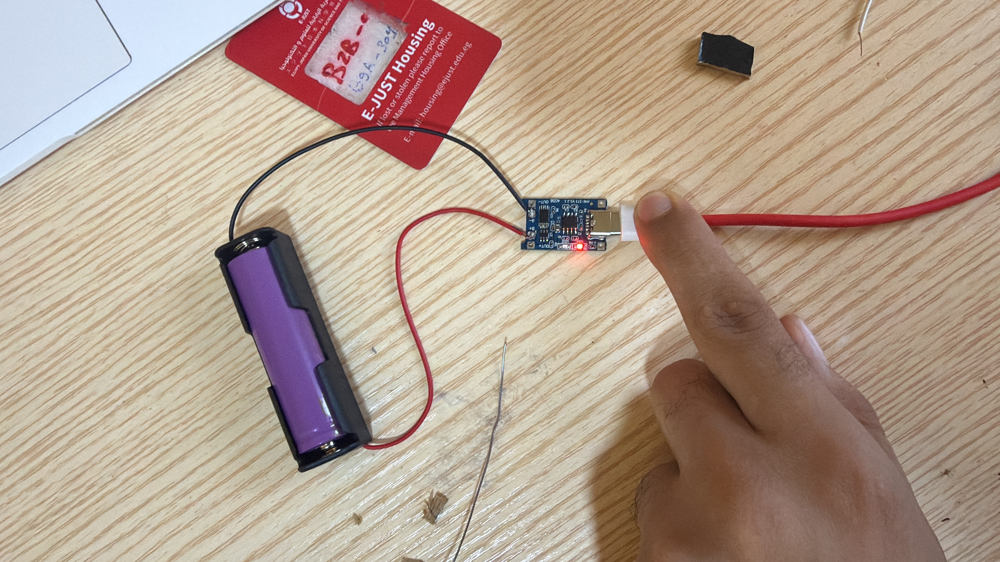<br/>
  <i>Bench build: MYOSA OLED display board and audio/sensor daughterboard wired and test-fitted inside the laser-cut enclosure before final assembly</i>
</p>

<p align="center">
  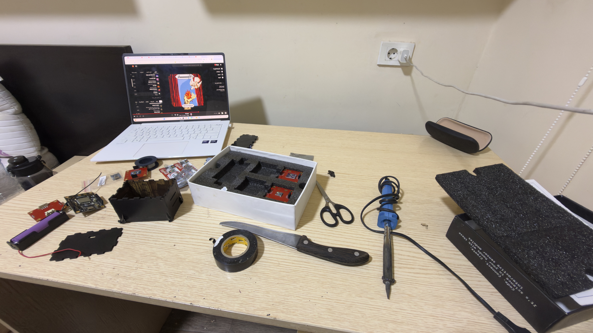<br/>
  <i>Fitting the OLED module and Li-ion cell into the enclosure — checking clearance and wire routing before gluing panels shut</i>
</p>

<p align="center">
  <br/>
  <i>Full electronics stack laid out and wired on the bench: battery, charging/boost module, MYOSA motherboard, IMU board, and OLED display, prior to enclosure integration</i>
</p>

<p align="center">
  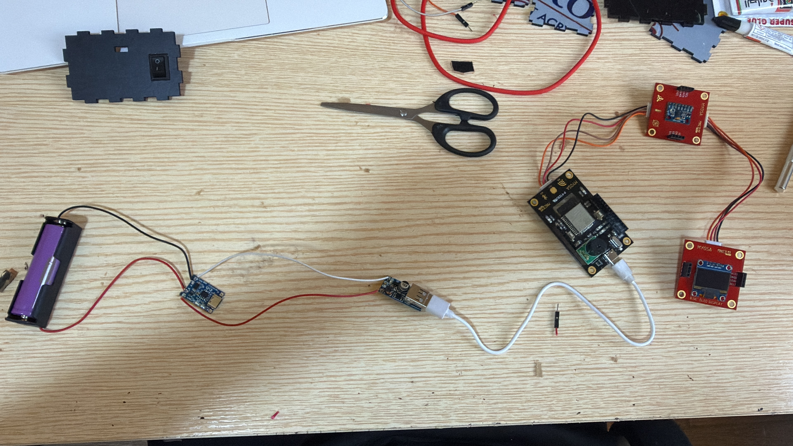<br/>
  <i>Close-up of the MYOSA motherboard (MCU, BLE, WiFi, buzzer) connected to the IMU sensor board, mid-assembly inside the enclosure shell</i>
</p>

<p align="center">
  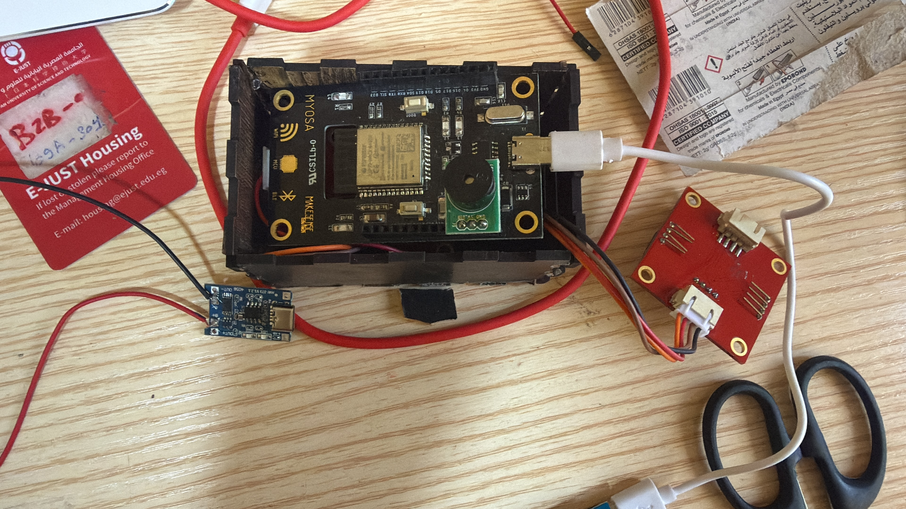<br/>
  <i>Full kit unboxing and workstation setup: MYOSA sensor boards, laser-cut enclosure panels, battery, adhesives, and tools laid out before assembly</i>
</p>

<p align="center">
  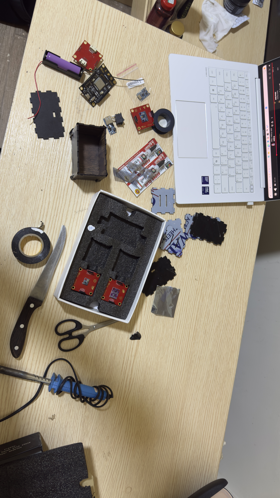<br/>
  <i>Assembly desk: enclosure panels, MYOSA boards, and soldering iron set up for the build session</i>
</p>

<p align="center">
  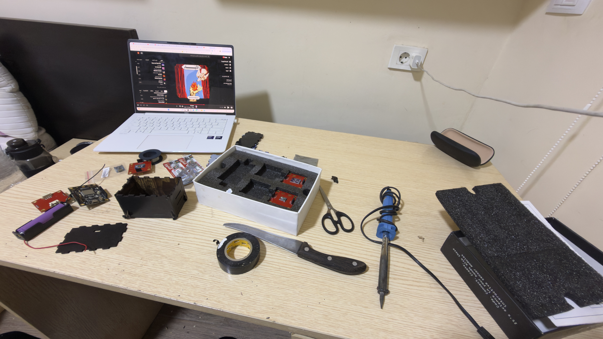<br/>
  <i>Firmware development in progress — flashing and debugging the Arduino sketch on the MYOSA dev module while assembling the enclosure alongside it</i>
</p>

<p align="center">
  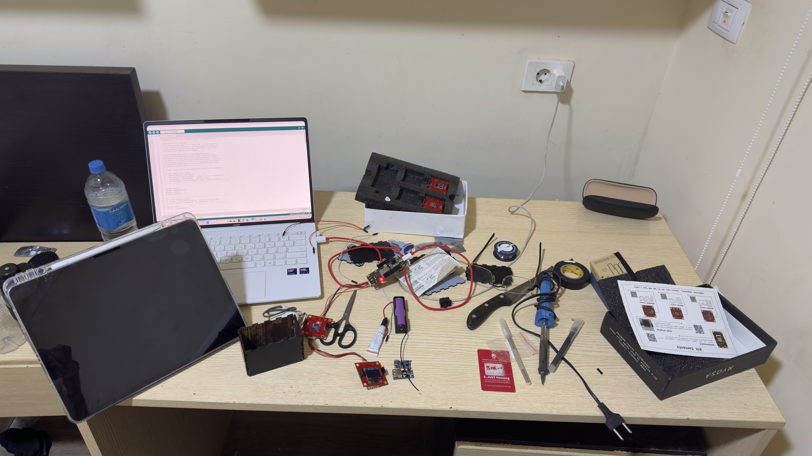<br/>
  <i>Debugging session: MYOSA board powered on (status LED lit) and connected via USB while the firmware is edited and re-flashed</i>
</p>

<p align="center">
  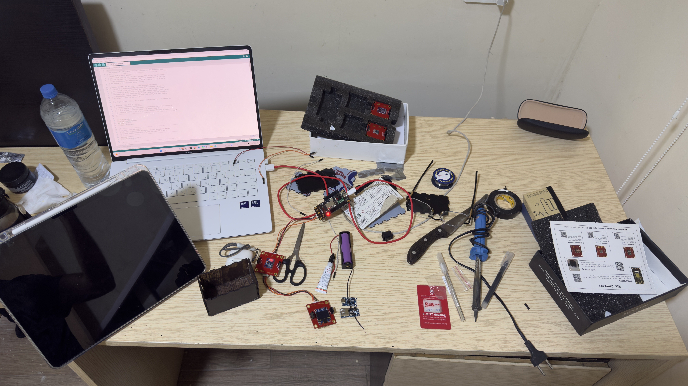<br/>
  <i>Continued firmware debugging and wiring checks at the desk, cross-referencing the Arduino IDE serial output against the physical connections</i>
</p>

<p align="center">
  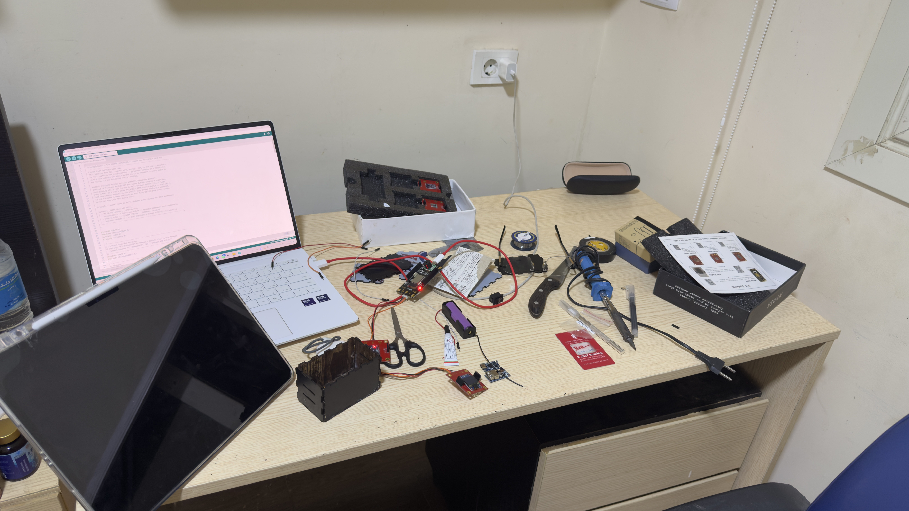<br/>
  <i>Final wiring pass before closing up the enclosure — components laid out for one last continuity check</i>
</p>

<p align="center">
  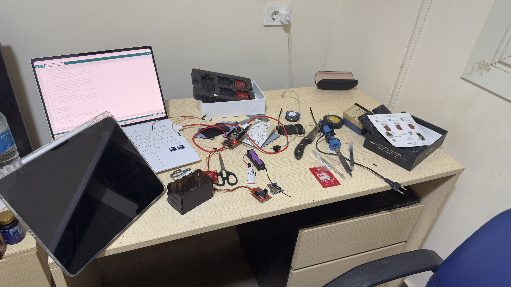<br/>
  <i>Enclosure lid removed, showing the OLED display, IMU board, and battery seated inside the finished laser-cut wood housing</i>
</p>

<p align="center">
  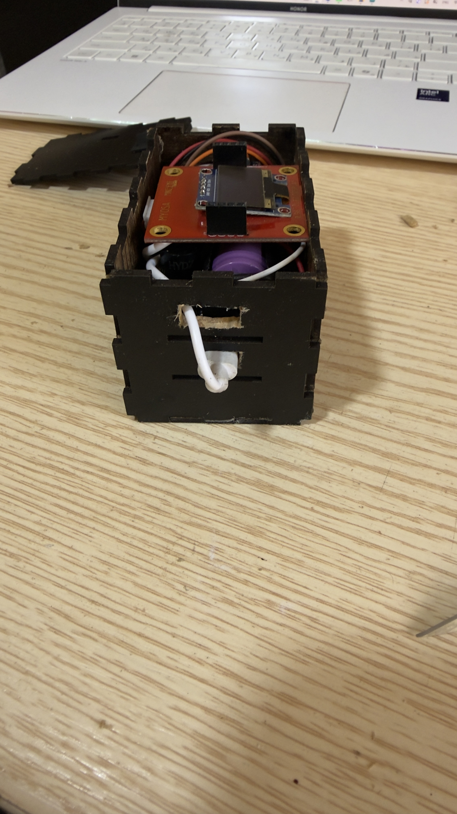<br/>
  <i>Assembled wearable worn on a volunteer's neck, OLED showing a live "Status: Normal" reading during a test session</i>
</p>

<p align="center">
  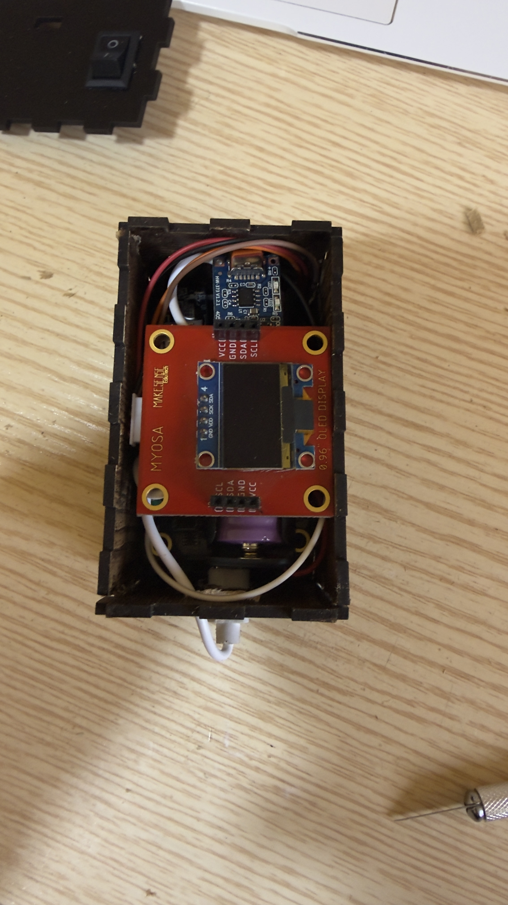<br/>
  <i>Volunteer wearing DysphagiaGuard on the neck strap during a live testing session</i>
</p>

> **Note:** Replace the placeholder filenames above with your actual JPG/PNG files, keeping them in the same folder as this markdown file, lowercase, no spaces, matching these names exactly (or update the `src` paths to match your real filenames).

### Videos

**🎥 Project Presentation & Testing**

[▶ Click here to watch the Project Presentation & Testing](assets/videos/presentation.mp4)

**🎥 Backstage / Build Process**

[▶ Click here to watch the Backstage / Build Process](assets/videos/backstage.mp4)

---

## Features (Detailed)

### 1. Continuous IMU Sensing of Swallow Kinematics

The MYOSA IMU sensor board is worn over the laryngeal prominence and streams raw 6-axis data (3-axis acceleration + 3-axis angular velocity) at **~100 Hz**. This captures the characteristic vertical displacement of the hyoid-laryngeal complex during a swallow — the primary kinematic signature the whole pipeline is built around.

Each sample is pushed live to Firebase in the shape:

```json
{
  "ax": 0.01, "ay": -0.02, "az": 0.98,
  "gx": 0.4,  "gy": -0.1,  "gz": 0.05,
  "t":  1234567
}
```

### 2. On-Device Signal Processing & Feature Extraction

Every 3-second window (300 samples at 100 Hz) is reduced to **48 features** — 8 features per axis (mean, std, RMS, peak, energy, zero-crossing rate, spectral centroid, spectral flatness) across all 6 IMU channels, in a fixed order that must exactly match the order used during model training. These are then normalized with the same scaler statistics exported from the training pipeline before being fed to the classifier.

### 3. Dual Classification Approach: TinyML Model + Interpretable Heuristic

Two classification paths are implemented side by side:

- **TinyML path (TFLite):** A quantized neural network trained in Edge Impulse takes the 48 normalized features and outputs softmax probabilities across `[normal, delayed_incomplete, aspiration_risk]`.
- **Heuristic path:** A transparent, rule-based classifier that reasons directly over calibrated gyroscope-magnitude and accelerometer-Z motion signatures — peak magnitude, event duration, settle time, and secondary "cough-like" spikes — against a per-device baseline captured during a 30-second calibration hold. This keeps the decision logic inspectable rather than a black box, and was used to drive the live demo classification while the TFLite path stays wired up for its intended on-device role.

### 4. Local Alerting (OLED + Buzzer)

The MYOSA OLED display shows the live classification status and running sample count. The buzzer stays **silent for Normal Swallow** and rings in a 1-second on/off pattern for **Delayed** or **Aspiration Risk** classifications, giving the wearer an immediate, unambiguous physical alert without needing to look at a screen.

### 5. Firebase Realtime Database as the Live Bridge

Firebase RTDB is the single source of truth connecting the firmware and the mobile app:

- `/devices/<deviceId>/live` — firmware writes each raw IMU sample here (~100 Hz)
- `/devices/<deviceId>/status` — classification result written back, polled by the firmware every 500 ms to drive the buzzer/OLED

The Flutter app listens to `/live` for real-time streaming and visualization, and writes classification results back to `/status`.

### 6. Flutter Companion Dashboard

The companion app (built with Flutter + `firebase_database` + `flutter_litert` for on-device TFLite inference) gives the caregiver a live, readable view of:

- A **scrolling waveform** of the incoming IMU signal, with a glowing "live" leading edge
- A **buffering ring** showing progress toward the next 3-second inference window
- **Metric cards** for current classification, confidence, and session stats
- A **scrollable event history** log with color-coded risk levels (mint = normal, amber = delayed, coral = aspiration risk) and timestamps
- A **calibration flow** — a 30-second still-hold at the start of each session to capture the per-wearer motion baseline used by the heuristic classifier

### 7. Custom Wearable Enclosure

A lightweight, laser-cut and 3D-printed neck-mount enclosure (approx. **8.5 × 5 × 5 cm**) houses the MYOSA motherboard and IMU board in a fixed anatomical position, minimizing motion artifact from enclosure shifting and keeping sensor placement repeatable across wear sessions. Panels were laser-cut from **wood and acrylic** from a DXF layout, then assembled around the MYOSA stack for a low-mass, breathable, all-day-wearable housing.

---

## Usage Instructions

### 1. Flash the Firmware

Open `DysphagiaGuard_Final_Code.ino` in the Arduino IDE with the MYOSA/ESP32 board package installed, then set your own WiFi and Firebase credentials before flashing:

```cpp
#define WIFI_SSID          "YOUR_WIFI_SSID"
#define WIFI_PASSWORD      "YOUR_WIFI_PASSWORD"
#define FIREBASE_HOST      "https://YOUR_PROJECT-default-rtdb.firebaseio.com/"
#define FIREBASE_AUTH_TOKEN "YOUR_FIREBASE_DATABASE_SECRET"
#define DEVICE_ID          "dysphagiaguard-01"
```

> ⚠️ **Security note:** never commit real WiFi passwords or Firebase database secrets to a public repository or blog submission. Treat the database secret as a password — generate it from **Firebase Console → Project Settings → Service Accounts / Database Secrets**, and rotate it immediately if it's ever been shared or committed in plaintext.

The firmware includes a `LOCAL_STATUS_TEST_MODE` flag that bypasses WiFi/Firebase entirely and cycles through `Normal → Aspiration → Delayed` locally every 5 seconds — useful for verifying the buzzer and OLED in isolation before testing the full network pipeline.

### 2. Set Up the Flutter App

```bash
flutter pub get
flutterfire configure   # generates YOUR real firebase_options.dart — do not reuse the sample one
flutter run
```

Make sure the `deviceId` in `main.dart` matches the `DEVICE_ID` set in the firmware:

```dart
home: const DashboardScreen(deviceId: 'dysphagiaguard-01'),
```

Confirm the TFLite model and stats files are bundled as assets in `pubspec.yaml`:

```yaml
flutter:
  assets:
    - assets/models/dysphagia_imu_model_float32.tflite
    - assets/models/feature_stats.json
```

### 3. Calibrate Before Each Session

On launch, hold the wearable still for the 30-second calibration window. This captures the gyroscope/accelerometer resting baseline the heuristic classifier uses to detect motion events against.

### 4. Laser-Cut the Enclosure

Use `esp32_enclosure_8_5x5x5cm.dxf` with your laser cutter's software (e.g. LightBurn) on 3 mm wood or acrylic sheet. Panels are sized to house the MYOSA motherboard and IMU board in a fixed neck-mount orientation.

---

## Tech Stack

* **MYOSA Mini Platform** — motherboard, IMU sensor board, OLED display, buzzer, BLE
* **C++ / Arduino Framework** — ESP32 firmware (`AccelAndGyro`, `oled`, `FirebaseESP32`, `WiFi`)
* **Firebase Realtime Database** — live IMU streaming + classification status bridge
* **Flutter / Dart** — cross-platform companion mobile app
* **TensorFlow Lite (`flutter_litert`)** — on-device TinyML inference
* **Edge Impulse** — TinyML model training and quantization workflow
* **Python / NumPy / scikit-learn** (training pipeline) — feature engineering and `StandardScaler` normalization
* **Laser cutting (wood & acrylic)** + **3D printing** — custom neck-mount wearable enclosure

---

## Requirements / Installation

**Firmware (Arduino IDE):**

```plaintext
Board: MYOSA / ESP32
Libraries: Wire, AccelAndGyro, oled, WiFi, FirebaseESP32
```

**Flutter app:**

```bash
flutter pub get
```

Key packages used: `firebase_core`, `firebase_database`, `flutter_litert`, `intl`.

---

## File Structure (Optional)

```
/DysphagiaGuard
  ├─ dysphagiaguard.md
  ├─ cover.jpg
  ├─ (project images...)
  ├─ dysphagiaguard-presentation-and-testing.mp4
  ├─ dysphagiaguard-backstage.mp4
  │
  ├─ firmware/
  │   └─ DysphagiaGuard_Final_Code.ino
  │
  ├─ ml_model/
  │   ├─ dysphagia_imu_model_float32.tflite
  │   └─ feature_stats.json
  │
  ├─ flutter_app/
  │   ├─ main.dart
  │   ├─ firebase_options.dart          # regenerate with your own `flutterfire configure`
  │   ├─ screens/
  │   │   └─ dashboard_screen.dart
  │   ├─ widgets/
  │   │   ├─ buffer_ring.dart
  │   │   ├─ live_waveform.dart
  │   │   ├─ metric_widgets.dart
  │   │   └─ alert_banner.dart
  │   ├─ inference/
  │   │   ├─ feature_extractor.dart
  │   │   ├─ feature_stats.dart
  │   │   ├─ simple_fft.dart
  │   │   ├─ swallow_classifier.dart
  │   │   └─ heuristic_swallow_classifier.dart
  │   ├─ data/
  │   │   ├─ live_imu_feed.dart
  │   │   └─ imu_sample.dart
  │   └─ theme/
  │       └─ app_theme.dart
  │
  └─ hardware/
      └─ esp32_enclosure_8_5x5x5cm.dxf
```
